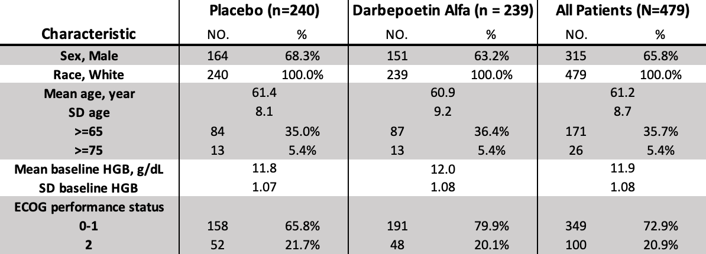

```{r setup, include=FALSE}
knitr::opts_chunk$set(echo = T)
```

## Description of the study
>1. Purpose                                                                           
The purpose of this study is to evaluate whether increasing or maintaining hemoglobin concentrations with darbepoetin alfa could increase patients, who are with previously untreated extensive-stage small-cell lung cancer(SCLC) receiving first-line plantinum-containing chemotherapy, survival.

>2. Outcome Measures
 (i) Primary Outcome Measures
+ Change in hemoglobin concentration from baseline to end of chemotherapy period
+ Overall survival
 (ii) Secondary Outcome Measures
+ Change in FACT-fatigue subscale scores from baseline to the end of study treatment
+ Incidence of Adverse Events (including serious and treatment related)
+ Changes in laboratory values, changes in vital signs and incidence of concomitant medications

>3. Patient Population                                                                
It shows 600 enrolled patients but the dataset only consists 479 records of patients. Patients are all 18-year-old or over white female or male.

>4. Below is a description of key varibles. Clinical characteristics and baseline demographics were similar between the 'placebo' group and the 'darbepoetin alfa' group.



## R packages

```{r}
library(haven)
library(dplyr)
library(tibble)
library(purrr)
library(tidyr)
library(forcats)
library(ggplot2)
data(dl)
```

## Process the data(1)

```{r}
# import the data
# please change Knit Directory to "Projecr Directory"
# fns <- dir("data/NCT00119316")
# fns <- fns[grep("sas7bdat", fns)]
# dl <- map(fns, ~ read_sas(file.path("data/NCT00119316", .x)))
# prefix <- gsub(".sas7bdat", "", fns)
# 
# names(dl) <- prefix
map(dl, ~ names(.x)[grep("TX", names(.x))])

trt <- dl$a_eendpt %>%
  select(SUBJID, TX) 

attributes(dl)
attributes(dl$c_keyvar)
attributes(dl$c_disp)

dl$c_keyvar %>% 
  as.data.frame() %>%
  head()

ncol(dl$c_keyvar)
table(dl$c_keyvar$SITEID)

dl$c_disp %>% 
  as.data.frame() %>%
  head()

dl$c_disp[, c("DISRSP", "SUBJID")] %>%
  head(50) %>%
  as.data.frame()


# nest the c_ae table
aec <- dl$c_ae %>%
  mutate(SEVR = 
           factor(SEVR, 
                  levels = c("Mild", "Moderate", "Severe", 
                             "Life threatening", "Fatal"))) %>%
  mutate(sevr_num = as.integer(SEVR)) %>%
  select(SUBJID, AGE, SEX, SEVR, AEBCTERM, STUDYDAY, AEDUR, HITERM1, sevr_num) %>%
  nest(aes = -c(SUBJID, AGE, SEX)) %>%
  mutate(num_ae = map_int(aes, nrow))

ar <- full_join(aec,dl$c_disp %>% select(SUBJID,DISRSP))
```

## Process the data(2)


```{r}
# Create another feature
get_worst_ae <- function(x) {
  na_ret <- factor(NA, 
                   levels = c("Mild", "Moderate", "Severe", 
                              "Life threatening", "Fatal"))
  
  if (is.null(x) || nrow(x) == 0) {
    return(na_ret)
  }
  ret <- x$SEVR[which.max(as.integer(x$SEVR))]
  if (length(ret)  == 0) {
    ret <- na_ret
  }
  ret
}

ar$worst_ae <- map(ar$aes, get_worst_ae) %>% 
  reduce(c)

# Plot the sequence of ae's 
plot_ae <- function(x) {
  ggplot(x, aes(x = STUDYDAY, y = sevr_num, label = AEBCTERM)) +
    geom_line() +
    geom_point() +
    theme_minimal()
}

ar$ae_long_plot <- map(ar$aes, plot_ae)

# Make it interactive
library(plotly)
ggplotly(ar$ae_long_plot[[1]])
table(ar$worst_ae)

# Show how many NAs
num_na <- function(x) {
  sum(is.na(x))
}

ar %>%
  select_if(negate(is.list)) %>%
  map_dbl(~ sum(is.na(.x)))

num_na <- compose(sum, is.na)

ar <- ar %>%
  na.omit() %>%
  mutate(ae_long_plotly = map(ae_long_plot, ~ ggplotly(.x)))
```
#### The plot above shows one patient's severity trend of adverse events over time. The severity grows as treatment progresses, which is a common trend for most patients in the treatment group as shown in the following trelliscope.


```{r}
# Trelliscope plot: AE's and Response

library(trelliscopejs)

trelliscope(
  ar,
  "AE's and Response", 
  panel_col = "ae_long_plotly",
  path = "ae-long-plot")
```

#### We use trelliscope to exhibit each individual's severity trend of adverse events over time. By checking the adverse events severity case by case, we notice that it is quite common for patients to appear moderate and severe adverse events and most of them have suffered from 5 to 20 adverse events during the trial.For some patients, fatal adverse events may even occur. Therefore it is necessary to know which types of patients tend to have more serious adverse events.


## plot: medical & surgical history VS ae

```{r}
# plot: medical & surgical history VS ae

MEDHXCD_label = function(x){
  if (x == 2){
    "Cardiovascular"
  }else if(x == 3){
    "Resporatory"
  }else if(x == 4){
    "Gastrointestinal"
  }else if(x == 5){
    "Hepatic/Biliary"
  }else if(x == 7){
    "Renal"
  }else if(x == 8){
    "Endocrine/Metabilic"
  }else if(x == 10){
    "Hematologic/Lymphatic"
  }else if(x == 11){
    "Neurologic/Psychiatric"
  }else if(x == 16){
    "Immunologic"
  }else if(x == 20){
    "Hypertension"
  }else if(x == 22){
    "Thrombosis Not Central Line"
  }else{
    "Unknown"
  }
}

medhis <- full_join(ar,dl$c_medhis %>% select(SUBJID,MEDHXYN,MEDHXCD) %>% filter(MEDHXYN == 1))
medhis <- medhis %>%
  select(SUBJID, num_ae, DISRSP, worst_ae, MEDHXYN, MEDHXCD) %>%
  na.omit(MEDHXCD) %>%
  mutate(MEDHXCD = map_chr(MEDHXCD, MEDHXCD_label))

table(medhis$MEDHXCD)
table(medhis$worst_ae)

# p1 <- ggplot(medhis %>% filter(worst_ae == "Mild"),aes(x=factor(MEDHXCD),y=..count..)) + 
#   geom_bar(col="white",aes(fill=..count..)) +
#   labs(title= "Mild AE", x="Disease History", y="Count")+
#   theme(axis.text.x = element_text(angle = 15))
# p2 <- ggplot(medhis %>% filter(worst_ae == "Moderate"),aes(x=factor(MEDHXCD),y=..count..))+ 
#   geom_bar(col="white",aes(fill=..count..)) +
#   labs(title= "Moderate AE", x="Disease History", y="Count")+
#   theme(axis.text.x = element_text(angle = 15))
# p3 <- ggplot(medhis %>% filter(worst_ae == "Severe"),aes(x=factor(MEDHXCD),y=..count..))+ 
#   geom_bar(col="white",aes(fill=..count..)) +
#   labs(title= "Severe AE", x="Disease History", y="Count")+
#   theme(axis.text.x = element_text(angle = 15))
# p4 <- ggplot(medhis %>% filter(worst_ae == "Fatal"),aes(x=factor(MEDHXCD),y=..count..))+ 
#   geom_bar(col="white",aes(fill=..count..)) +
#   labs(title= "Fatal AE", x="Disease History", y="Count")+
#   theme(axis.text.x = element_text(angle = 15))
# 
# library(ggpubr)
# ggarrange(p1, p2, ncol = 1, nrow = 2, align = "v", common.legend = T)
# ggarrange(p3, p4, ncol = 1, nrow = 2, align = "v", common.legend = T)


ggplot(medhis,aes(x=factor(MEDHXCD),y=..count.., group=worst_ae)) + 
  geom_bar(col="white",aes(fill=worst_ae)) +
  labs(title= "Disease History and AE", x="Disease History", y="Count")+
  theme(axis.text.x = element_text(angle = 15))

ggplot(medhis %>% count(MEDHXCD, worst_ae),aes(x=factor(MEDHXCD),y=n, fill=worst_ae)) + 
  geom_bar(col="white",position = "fill", stat = "identity") +
  scale_y_continuous(labels = scales::percent) +
  labs(title= "Disease History and AE", x="Disease History", y="Proportion")+
  theme(axis.text.x = element_text(angle = 15))

```

#### By first plotting the count of adverse events with groups of disease history, we can see the incidence of adverse events, especially severe and fatal adverse events is higher for patients with cardiovascular. The following two groups that need more attention are patients with hypertension and resporatory thrombosis.

#### The second chart bar shows the proportion of different levels of adverse events in each disease history group. For all the diseases shown above, severe and fatal adverse events account for more than 50%.

## Plot: Histogram of Age

```{r}
# Histogram of Age
ggplot(data=dl$a_eendfu, aes(dl$a_eendfu$AGE)) + 
  geom_histogram(breaks=seq(20, 85, by=2), 
                 col="red", 
                 aes(fill=..count..)) +
  scale_fill_gradient("Count", low="green", high="red")+ 
  labs(title= "Histogram of Age", x="Age", y="Count")
```

#### To analyze the effect of age on adverse events, we first plot the age distribution of patients. According to the histogram above, we divide the ages into 5 groups: Below 45, (45, 55], (55, 65], (65, 75], Above 75, which will be used in the following analysis.

# Plot: Scatter plot 
```{r}
ggplot(ar %>% filter(ar$DISRSP != "Missing" & ar$DISRSP != "Unable to Evaluate"), aes(x = AGE, y = num_ae, color = num_ae)) +
  geom_jitter(alpha = 0.8) +
  facet_grid(DISRSP ~ .) +
  theme(strip.text.y = element_text(size = 6, colour = "royalblue4")) +
  theme(strip.background.y = element_rect(fill = "powderblue", colour = "powderblue"))
```

#### To show the distribution of ae numbers with the change of age in different final response groups. We could tell that, in "Progressive Disease" group, the number of adverse events increases a little bit with the increase of age. Most patients' adverse events numbers are below 20.

# Plot: Heatmap 
```{r}
# windowsFonts("Arial" = windowsFont("Arial"))
ar %>%  mutate(AGEGROUP = ifelse(AGE <= 45, "Below 45",
                           ifelse(AGE <= 55, "(45, 55]",
                                  ifelse(AGE <= 65, "(55, 65]",
                                         ifelse(AGE <= 75, "(65, 75]","Above 75"))))) %>%
group_by(AGEGROUP,SEX) %>%
   summarise(avg_worst_ae = mean(as.numeric(worst_ae))) %>%
ggplot(aes(AGEGROUP, SEX, fill = avg_worst_ae)) +
geom_tile() +
theme_minimal() +
labs(x = "Age", y = "Sex", fill = "Worst Adverse Event Level") + scale_fill_distiller(palette = "RdBu") +
theme(legend.position =
"bottom",text=element_text(family="Arial",size=10)) 
```

#### To show the distribution of ae numbers with the change of age in different final response groups. We could tell that, in "Progressive Disease" group, the number of adverse events increases a little bit with the increase of age. Most patients' adverse events numbers are below 20.

## Plot: Telliscope plot: age/sex vs HGB (by sample)
```{r}
# nest the HGB table
library(data.table)
HGB <- dl$a_eendfu %>%
  select(SUBJID, AGE, SEX, TXGROUP, c(starts_with("HGB"))) %>%
  data.table() %>%
  melt(id = c("SUBJID", "AGE", "SEX", "TXGROUP")) %>%
  data.frame() %>%
  mutate(STUDYWEEK = as.numeric(sub("HGB*", "", variable))) %>%
  select(-variable) %>%
  na.omit(value) %>%
  nest(hgbs = - c(SUBJID, AGE, SEX, TXGROUP)) %>%
  mutate(num_test = map_int(hgbs, nrow))

plot_hgb <- function(x) {
  ggplot(x, aes(x = STUDYWEEK, y = value)) +
    geom_line() +
    geom_point() +
    theme_minimal()+ 
    labs(x="Study Week", y="HGB Value")
}

HGB$hgb_long_plot <- map(HGB$hgbs, plot_hgb)

library(plotly)
ggplotly(HGB$hgb_long_plot[[1]])

HGB <- HGB %>%
  na.omit() %>%
  mutate(hgb_long_plotly = map(hgb_long_plot, ~ ggplotly(.x)))

trelliscope(
  HGB,
  "HGB variation tracking", 
  panel_col = "hgb_long_plotly",
  path = "hgb-long-plot")

```

#### Then we use treslliscope to exhibit each individual's HGB variation throughout the trial. Most patients have a decreasing trend in HGB.

## Plot: Line plot: mean change in Hemoglobin from baseline
```{r}
# compute change in HGB
HGBchange <- dl$a_eendfu %>%
  select(starts_with("HGB")|TXGROUP)

get_baseline <- function(x){
  # browser()
  if (!is.na(x[1])){
    x[[1]][1]
  }else if (!is.na(x[2])){
    x[[2]][1]
  }else if (!is.na(x[3])){
    x[[3]][1]
  }else{
    x[[4]][1]
  }
}

HGBchange[["baseline"]] = HGBchange[[1]]
for (i in 1:nrow(HGBchange)){
  HGBchange[["baseline"]][i] = get_baseline(HGBchange[i, ])
}

for (i in 1:25){
  varname <- paste("HGBchange", i, sep = "_")
  HGBchange <- HGBchange %>%
    mutate(!!varname := HGBchange[[i]] - HGBchange[["baseline"]])
}

HGBchange <- HGBchange %>%
  select(starts_with("HGBchange")|TXGROUP)

placebo_mean = c()
placebo_sd = c()
placebo_cnt = c()
nesp_mean = c()
nesp_sd = c()
nesp_cnt = c()
study_week = c(1:24)
for (i in 2:25){
  # browser()
  placebo_i <- HGBchange %>%
    filter(TXGROUP == "PLACEBO") %>%
    select(i)
  nesp_i <- HGBchange %>%
    filter(TXGROUP != "PLACEBO") %>%
    select(i)
  placebo_mean <- placebo_i[[1]] %>%
    mean(na.rm = T) %>%
    append(placebo_mean)
  placebo_sd <- placebo_i[[1]] %>%
    sd(na.rm = T) %>%
    append(placebo_sd)
  placebo_cnt <- is.na(placebo_i[[1]]) %>%
    sum %>%
    append(placebo_cnt)
  nesp_mean <- nesp_i[[1]] %>%
    mean(na.rm = T) %>%
    append(nesp_mean)
  nesp_sd <- nesp_i[[1]] %>%
    sd(na.rm = T) %>%
    append(nesp_sd)
  nesp_cnt <- is.na(nesp_i[[1]]) %>%
    sum %>%
    append(nesp_cnt)
}

data_HGB <- data.frame(study_week, placebo_mean, placebo_sd, placebo_cnt, nesp_mean, nesp_sd, nesp_cnt)

ggplot()+
  geom_line(data = data_HGB, aes(x = study_week,y = nesp_mean, colour = "Darbepoetin alfa"), size = 1)+
  geom_point(data = data_HGB, aes(x = study_week,y = nesp_mean, colour = "Darbepoetin alfa"), size = 3)+
  geom_line(data = data_HGB, aes(x = study_week,y = nesp_mean + 1.96 * nesp_sd / sqrt(nesp_cnt), colour = "Darbepoetin alfa"), size = 1, linetype="dashed")+
  geom_line(data = data_HGB, aes(x = study_week,y = nesp_mean - 1.96 * nesp_sd / sqrt(nesp_cnt), colour = "Darbepoetin alfa"), size = 1, linetype="dashed")+
  geom_line(data = data_HGB, aes(x = study_week,y = placebo_mean, colour = "Placebo"), size = 1)+
  geom_point(data = data_HGB, aes(x = study_week,y = placebo_mean, colour = "Placebo"), size = 3)+
  geom_line(data = data_HGB, aes(x = study_week,y = placebo_mean + 1.96 * placebo_sd / sqrt(placebo_cnt), colour = "Placebo"), size = 1, linetype="dashed")+
  geom_line(data = data_HGB, aes(x = study_week,y = placebo_mean - 1.96 * placebo_sd / sqrt(placebo_cnt), colour = "Placebo"), size = 1, linetype="dashed")+
  scale_colour_manual("", values = c("Darbepoetin alfa" = "yellow", "Placebo" = "blue"))+
  xlab("Study Week") + ylab("Mean Change in Hemoglobin From Baseline (g/dL)")+
  theme(text = element_text(size = 13, family = "Arial"))

```

#### The line graph shows changes in hemoglobin concentration throughout the study. Lines above and below the solid lines indicate upper and lower 95% confidence intervals, respectively. The mean change of darbepoetin alfa group seems to be significantly higher than the placebo group. Whether the difference is statistically significant will be tested in the "Hypothesis" part.

## Plot: Trelliscope plot: age/sex vs HGB (by group)
```{r}
# nest the HGB table
library(data.table)
HGB2 <- dl$a_eendfu %>%
  select(SUBJID, AGE, SEX, TXGROUP, c(starts_with("HGB"))) %>%
  data.table() %>%
  melt(id = c("SUBJID", "AGE", "SEX", "TXGROUP")) %>%
  data.frame() %>%
  mutate(STUDYWEEK = as.numeric(sub("HGB*", "", variable))) %>%
  mutate(AGEGROUP = ifelse(AGE <= 45, "Below 45",
                           ifelse(AGE <= 55, "(45, 55]",
                                  ifelse(AGE <= 65, "(55, 65]",
                                         ifelse(AGE <= 75, "(65, 75]","Above 75"))))) %>%
  select(-variable) %>%
  na.omit(value) %>%
  nest(hgbs = - c(AGEGROUP, SEX)) %>%
  mutate(num_test = map_int(hgbs, nrow))

plot_hgb2 <- function(x) {
  ggplot(x, aes(x = jitter(STUDYWEEK), y = value, color = TXGROUP)) +
    geom_point() +
    theme_minimal()+ 
    labs(x="Study Week", y="HGB Value")
}

HGB2$hgb2_long_plot <- map(HGB2$hgbs, plot_hgb2)

library(plotly)
ggplotly(HGB2$hgb2_long_plot[[1]])

HGB2 <- HGB2 %>%
  na.omit() %>%
  mutate(hgb2_long_plotly = map(hgb2_long_plot, ~ ggplotly(.x)))

trelliscope(
  HGB2,
  "HGB variation tracking over group", 
  panel_col = "hgb2_long_plotly",
  path = "hgb2-long-plot")

```

#### To analyze whether age and sex have influence on the HGB variation, we divide the sample into 10 groups. 

## Plot: Line plot: survival percentage in two groups
```{r}
survive_placebo = c() 
survive_nesp = c() 
study_week = c(1:170)
for (i in 1:length(study_week)){
  death_placebo <- dl$a_eendfu %>%
    filter(DTHWK <= i & DTH == 1 & TXGROUP == "PLACEBO") %>%
    count() %>%
    as.numeric()
  death_nesp <- dl$a_eendfu %>%
    filter(DTHWK <= i & DTH == 1 & TXGROUP != "PLACEBO") %>%
    count() %>%
    as.numeric()
  survive_placebo <- survive_placebo %>%
    append((nrow(dl$a_eendfu) - death_placebo)/nrow(dl$a_eendfu))
  survive_nesp <- survive_nesp %>%
    append((nrow(dl$a_eendfu) - death_nesp)/nrow(dl$a_eendfu))
}
data_survival = data.frame(survive_placebo, survive_nesp, study_week)
ggplot()+
  geom_line(data = data_survival, aes(x = study_week,y = survive_nesp, colour = "Darbepoetin alfa"), size = 1)+
  geom_line(data = data_survival, aes(x = study_week,y = survive_placebo, colour = "Placebo"), size = 1)+
  scale_colour_manual("", values = c("Darbepoetin alfa" = "yellow", "Placebo" = "blue"))+
  xlab("Study Week") + ylab("% of Survival")+
  theme(text = element_text(size = 13, family = "Comic Sans MS"))
```

#### Both groups' survival rate decrease during the study, while darbepoetin alfa group seems to have slower decreasing pace. This will be tested in the last "Hypothesis" part statistically.


## Hypothesis

### Test whether the drug has efficiency in maintaining hemoglobin levels
#### Patients’ hemoglobin levels dropped due to the myelosuppres-sive chemotherapy. From the plot of mean change in hemoglobin from baseline, we can see the hemoglobin levels of patients treated with darbepoetin alfa are significantly higher than the hemoglobin levels of patients treated with placebo. So whether the difference is statistically significant? We proposed a hypothesis that darbepoetin alfa is efficient in maintaining the hemoglobin levels higher and planned to conduct t-test to examine the hypothesis.
```{r}
t.test(data_HGB$placebo_mean,data_HGB$nesp_mean,alternative="less")
```

#### According to the results of t-test, p<0.05. Therefore, we can conclude that darbepoetin alfa has a significant efficiency in maintaining the hemoglobin levels at a higher level.


## Test whether the drug has efficiency in increasing survival rate
#### From the plot of survival rate, survival rates of patients with darbepoetin alfa tend to be higher than patients with placebo. Whether the difference is statistically significant? We proposed a hypothesis that darbepoetin alfa is efficient in increasing survival rate and planned to conduct t-test to examine the hypothesis.
```{r}
t.test(data_survival$survive_placebo,survive_nesp,alternative="less")
```

#### According to the results of t-test, p>0.05. Therefore, there was no statistically significant difference in overall survival between the treatment groups. Use of darbepoetin alfa has no significant efficiency in improving 

